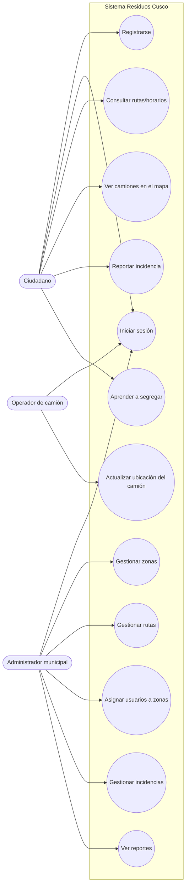
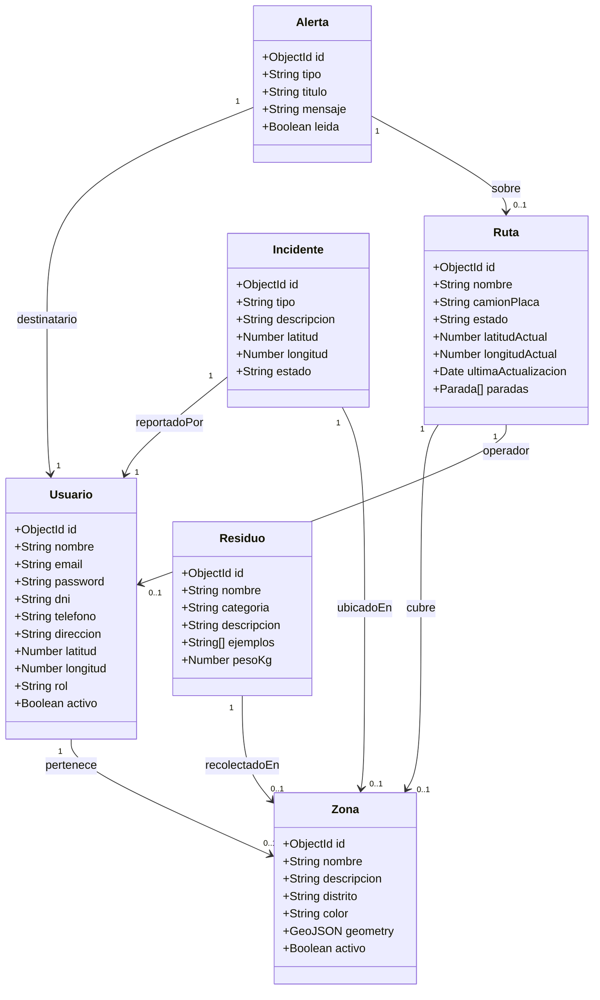
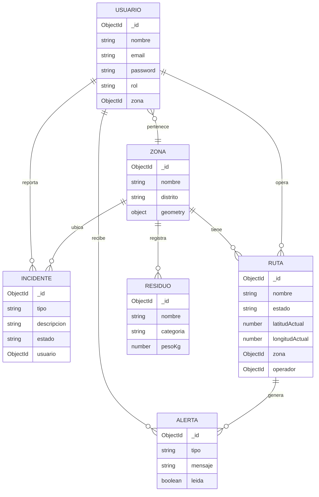
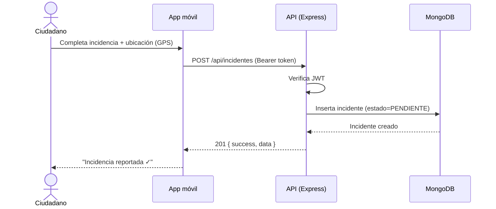
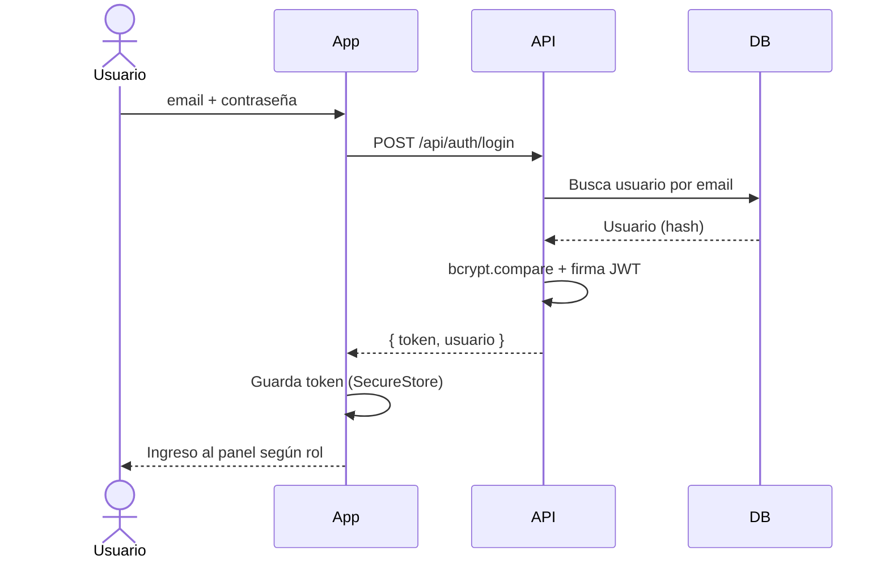
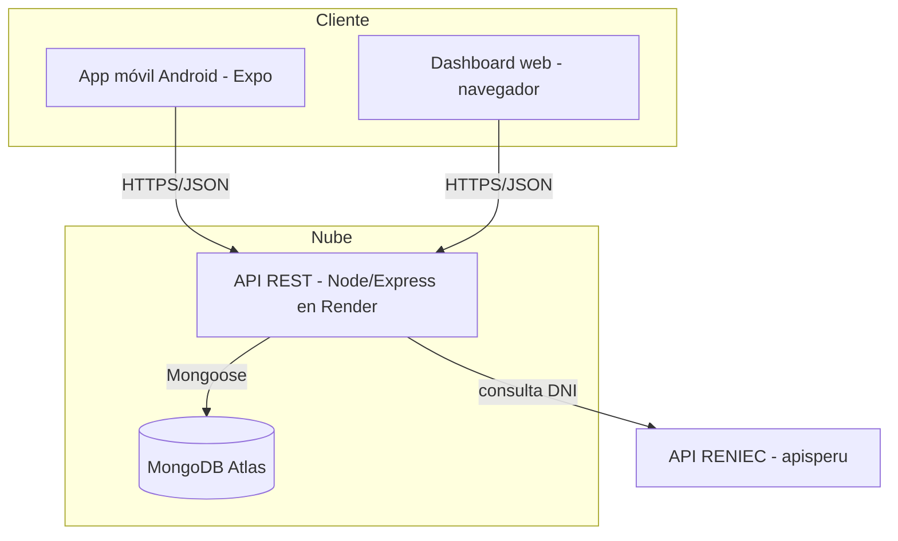

# Diagramas UML y Modelo de Datos — Residuos Cusco

> Diagramas en **Mermaid** y **PlantUML** (listos para insertar en el informe).
> Mermaid se renderiza directo en GitHub. PlantUML: pegar en https://www.plantuml.com/plantuml

---

## 1. Diagrama de Casos de Uso (Mermaid)



---

## 2. Diagrama de Clases / Modelo de Dominio (Mermaid)



---

## 3. Modelo de Datos (Entidad-Relación lógico, Mermaid)



---

## 4. Diagrama de Secuencia — Reporte de incidencia (Mermaid)



---

## 5. Diagrama de Secuencia — Inicio de sesión (Mermaid)



---

## 6. Diagrama de Componentes / Arquitectura (Mermaid)



---

## 7. Versión PlantUML del Diagrama de Clases (alternativa)

```plantuml
@startuml
class Usuario {
  +nombre: String
  +email: String
  +rol: String
}
class Zona { +nombre: String +geometry: GeoJSON }
class Ruta { +nombre: String +estado: String +latitudActual: Number }
class Incidente { +tipo: String +estado: String }
class Residuo { +nombre: String +categoria: String }
class Alerta { +mensaje: String +leida: Boolean }

Usuario "*" --> "0..1" Zona
Ruta "*" --> "0..1" Zona
Ruta "*" --> "0..1" Usuario
Incidente "*" --> "1" Usuario
Residuo "*" --> "0..1" Zona
Alerta "*" --> "1" Usuario
@enduml
```
