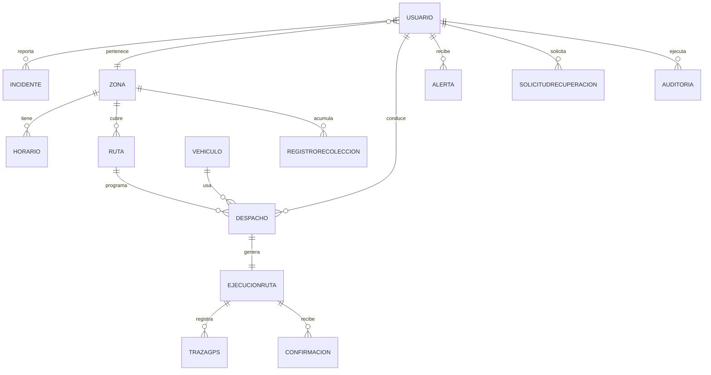
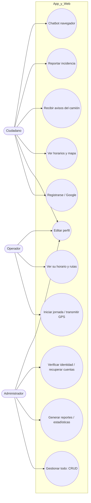
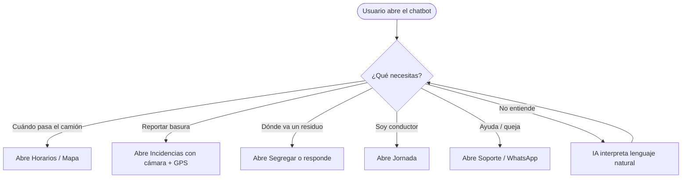
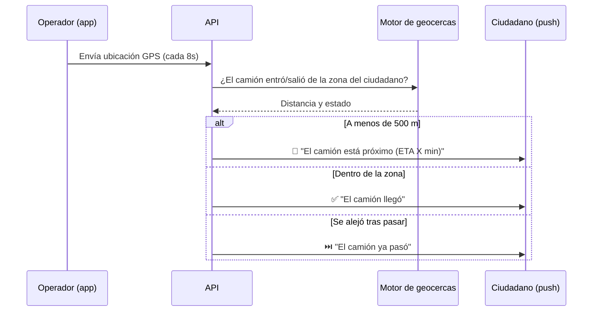
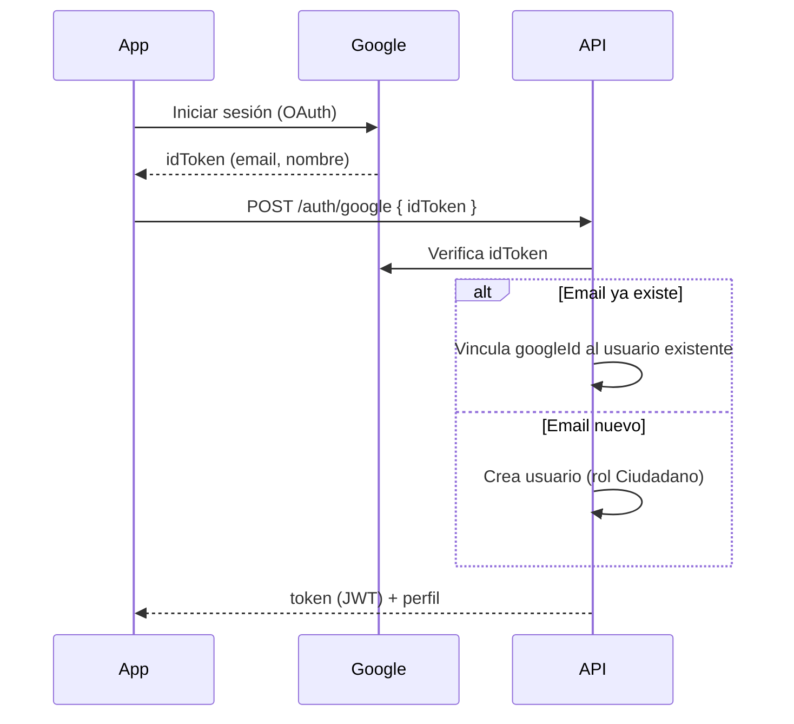
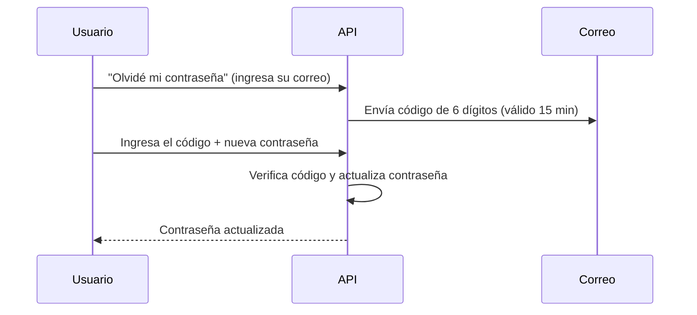
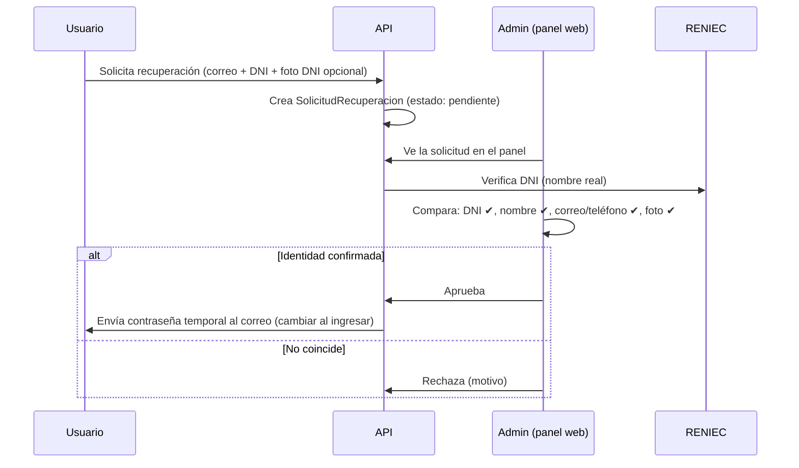

# Diseño técnico — Entrega 3 (Residuos Cusco)

> Bosquejo para el Capítulo III: base de datos robusta, diagramas (casos de uso por rol, chatbot, avisos del camión) y flujos de Google y recuperación de contraseña con verificación de identidad.
> Diagramas en **Mermaid** (se ven en GitHub).

---

## 1. Base de datos más robusta (nuevas colecciones)

MongoDB sigue siendo adecuado (escala bien y soporta índices geoespaciales). Lo "robusto" es **un esquema más completo**, no cambiar de motor.

| Colección | Para qué | Campos clave nuevos |
|---|---|---|
| **Usuario** | Personas | foto, verificado, googleId, ultimoAcceso |
| **Zona** | Sectores | geometry (polígono), color |
| **Horario** | Recojo por zona | zona, diaSemana, hora, tipoResiduo |
| **Ruta** | Recorrido | paradas[], polilínea (LineString), zona, operador, vehiculo |
| **Vehiculo** | Flota | placa, tipo, capacidadKg, activo |
| **Despacho/Turno** | Asignación | ruta, conductor, vehiculo, fecha, turno (AM/PM) |
| **EjecucionRuta** | Jornada real | ruta, inicio, fin, estado, distanciaKm |
| **TrazaGPS** | Historial de posiciones | ejecucion, [lng,lat], timestamp (índice TTL) |
| **Incidente** | Reportes | foto, evidencia, prioridad |
| **Residuo (catálogo)** | Tipos | categoria, color, instrucciones (es/qu) |
| **RegistroRecoleccion** | Volúmenes | zona, tipo, pesoKg, fecha (para reportes) |
| **Alerta/Notificacion** | Avisos | tipo (PROXIMIDAD/LLEGO/PASO/RETRASO), leida, pushToken |
| **Confirmacion** | Ciudadano confirma/califica | ejecucion, usuario, califico (1-5) |
| **SolicitudRecuperacion** | Recuperar contraseña | usuario, dni, estado, verificadoPor, fotoDni |
| **Auditoria** | Quién cambió qué | actor, accion, entidad, antes/después, fecha, ip |

Índices: `2dsphere` en Zona.geometry y TrazaGPS; índice por zona/fecha en RegistroRecoleccion; TTL en TrazaGPS (ej. 60 días).

### Modelo Entidad-Relación (resumen)

---

## 2. Casos de uso por rol

---

## 3. Flujo del Chatbot navegador

---

## 4. Flujo de avisos del camión (próximo / llegó / pasó)

---

## 5. Vincular cuenta de Google

- Vinculación por **correo**: si el correo de Google ya está registrado, se enlaza (`googleId`) a esa cuenta; si no, se crea una nueva.
- Requiere credenciales OAuth (Google Cloud): Client ID Web (backend) y Android (con SHA-1).

---

## 6. Recuperación de contraseña + verificación de identidad

Hay **dos enfoques** (se pueden combinar):

### Opción A — Autoservicio por correo (RECOMENDADA, más segura y sin carga al admin)

- **Identidad = control del correo** (estándar en la industria). No necesita al admin.

### Opción B — Mediada por el Administrador (lo que planteaste)

### ¿Cómo se verifica la identidad? (para devolver la cuenta)
El admin (o el sistema) confirma con **varios factores**:
1. **DNI vs RENIEC:** el DNI ingresado debe coincidir con el **nombre real** (API RENIEC ya integrada) y con el DNI registrado en la cuenta.
2. **Datos registrados:** correo y/o teléfono deben coincidir con los de la cuenta.
3. **Foto del DNI** (opcional): el usuario sube una foto; el admin la compara.
4. **Preguntas de seguridad** (opcional): definidas al registrarse.
5. Tras aprobar, **nunca** se muestra la contraseña anterior: se genera una **contraseña temporal** y se obliga a cambiarla en el primer ingreso.

> Recomendación: usar **Opción A (código por correo)** como principal (segura y automática) y dejar la **Opción B** solo para casos especiales (usuario sin acceso a su correo), con verificación por DNI/RENIEC + foto.

---

## 7. Notas de seguridad
- Los códigos/temporales **expiran** (15 min) y son de **un solo uso**.
- Toda acción del admin queda en **Auditoría** (quién aprobó qué recuperación).
- Las contraseñas siempre **cifradas (bcrypt)**; nunca se guardan ni muestran en texto plano.
